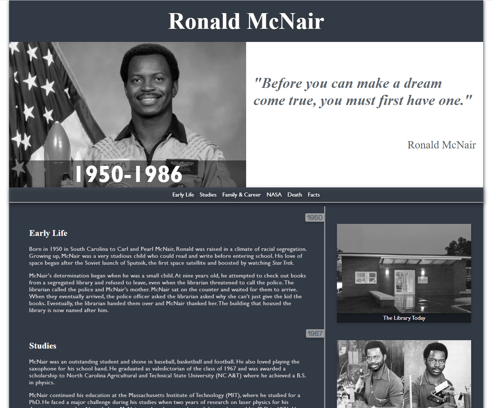
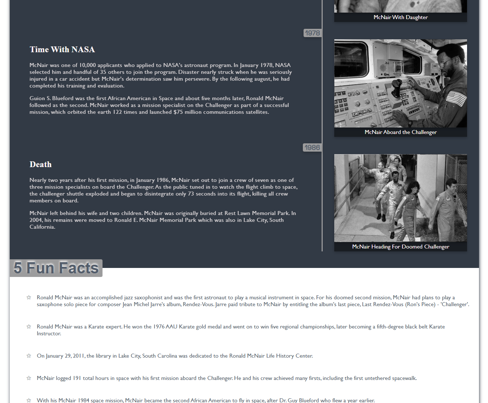

# Dr Ronald E. McNair Tribute Page

A responsive tribute page dedicated to Dr Ronald E. McNair, highlighting his life, achievements, and legacy through a clean, accessible layout.

## Screenshots


 


## Features

- Responsive design
- Timeline section highlighting key events in Dr McNair’s life
- Grid layout for media and additional content
- Clean, accessible, and readable interface

## Technologies Used

- HTML
- CSS
- JavaScript

## Installation / Usage

No installation required — simply open `index.html` in your browser to view the tribute page.

```bash
# Clone the repository
git clone https://github.com/yourusername/tribute-page.git

# Open the page in your browser
open index.html
```
## Authors

[Charlotte.D](https://github.com/C-Duberry)
